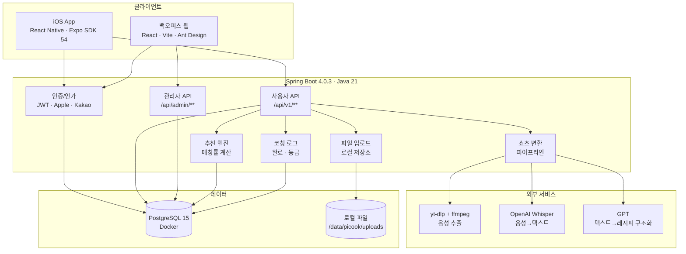

# Picook

> 냉장고 속 재료를 골라주면 레시피를 추천하고, 음성으로 요리를 코칭하며, 유튜브 쇼츠를 단계별 레시피로 변환해주는 iOS 앱

## 프로젝트 소개

"요리를 해보고 싶지만, 뭘 만들어야 할지 모르겠고, 레시피를 보면서 손은 바쁜데 화면을 넘기기 어렵다."

Picook은 요리 초보자의 이 문제를 해결하기 위해 만든 서비스입니다. 냉장고에 있는 재료를 체크하면 만들 수 있는 레시피를 추천하고, 음성 코칭 모드로 손을 쓸 필요 없이 단계별 안내를 받으며 요리할 수 있습니다. 유튜브 쇼츠 URL만 붙여넣으면 AI가 자동으로 단계별 레시피로 변환해주는 기능도 제공합니다.

**1인 풀스택 프로젝트**로, 기획부터 설계, 백엔드/프론트엔드/모바일 개발, 인프라 구축, 데이터 파이프라인까지 전 과정을 직접 수행했습니다.

---

## 시스템 아키텍처



---

## 기술 스택

| 영역 | 기술 | 선택 이유 |
|------|------|-----------|
| **백엔드** | Spring Boot 4.0.3 + Java 21 | 안정적인 엔터프라이즈 프레임워크, 최신 LTS |
| **데이터베이스** | PostgreSQL 15 (Docker) | JSONB 지원(쇼츠 캐시), 배열 타입(재료 ID), 트리거 |
| **DB 마이그레이션** | Flyway | 버전 관리형 스키마 관리, Spring Boot 통합 |
| **인증** | Spring Security + JWT | 액세스 토큰 1h + 리프레시 30d, Stateless |
| **모바일** | React Native (Expo SDK 54) + TypeScript | iOS 크로스 플랫폼, 빠른 개발 사이클 |
| **상태 관리** | Zustand + TanStack React Query | 경량 클라이언트 상태 + 서버 상태 캐싱 분리 |
| **백오피스** | React 19 + Vite 7 + Ant Design 5 | 빌드 속도, 풍부한 어드민 UI 컴포넌트 |
| **쇼츠 변환** | yt-dlp + Whisper API + GPT | 음성 추출→STT→구조화 3단 파이프라인 |
| **엑셀 처리** | Apache POI (서버) + SheetJS (클라이언트) | 레시피/재료 일괄 등록 |
| **모니터링** | Micrometer + Prometheus + 구조화 로깅 | 비즈니스 메트릭 + AOP 성능 추적 |
| **인프라** | AWS EC2 + Docker + Nginx + GitHub Actions | 비용 효율적 1인 개발 인프라 |

---

## ERD (Entity Relationship Diagram)

```mermaid
erDiagram
    users {
        UUID id PK
        VARCHAR email
        VARCHAR display_name
        VARCHAR login_type "KAKAO | APPLE"
        VARCHAR cooking_level "BEGINNER~ADVANCED"
        BOOLEAN coaching_enabled
        DECIMAL coaching_voice_speed
        INT completed_cooking_count
        BOOLEAN is_onboarded
        VARCHAR status "ACTIVE | SUSPENDED | DELETED"
        TIMESTAMPTZ created_at
    }

    ingredient_categories {
        SERIAL id PK
        VARCHAR name
        INT sort_order
    }

    ingredients {
        SERIAL id PK
        VARCHAR name UK
        INT category_id FK
        TEXT icon_url
    }

    ingredient_synonyms {
        SERIAL id PK
        INT ingredient_id FK
        VARCHAR synonym
    }

    recipes {
        SERIAL id PK
        VARCHAR title
        VARCHAR category "korean | western | ..."
        VARCHAR difficulty "easy | medium | hard"
        INT cooking_time_minutes
        INT servings
        BOOLEAN coaching_ready "trigger 자동계산"
        VARCHAR status "draft | published | hidden"
    }

    recipe_ingredients {
        SERIAL id PK
        INT recipe_id FK
        INT ingredient_id FK
        DECIMAL amount
        VARCHAR unit
        BOOLEAN is_required
    }

    recipe_steps {
        SERIAL id PK
        INT recipe_id FK
        INT step_number
        TEXT description
        VARCHAR step_type "active | wait"
        INT duration_seconds
        BOOLEAN can_parallel
    }

    favorites {
        SERIAL id PK
        UUID user_id FK
        INT recipe_id FK
    }

    feedback {
        SERIAL id PK
        UUID user_id FK
        INT recipe_id FK
        VARCHAR rating "delicious | okay | difficult"
        TEXT comment
        VARCHAR admin_status
    }

    search_history {
        SERIAL id PK
        UUID user_id FK
        INT_ARRAY ingredient_ids
        JSONB filters
        INT result_count
    }

    coaching_logs {
        SERIAL id PK
        UUID user_id FK
        VARCHAR mode "single | multi"
        INT_ARRAY recipe_ids
        INT shorts_cache_id FK
        INT estimated_seconds
        INT actual_seconds
        BOOLEAN completed
    }

    cooking_completions {
        SERIAL id PK
        UUID user_id FK
        INT recipe_id FK
        INT coaching_log_id FK
        TEXT photo_url
    }

    coaching_photos {
        SERIAL id PK
        INT coaching_log_id FK
        VARCHAR photo_url
        INT display_order
    }

    shorts_cache {
        SERIAL id PK
        VARCHAR youtube_url
        VARCHAR url_hash UK "SHA-256"
        VARCHAR ai_model_version
        JSONB result
        VARCHAR channel_name
        INT duration_seconds
    }

    shorts_conversion_history {
        SERIAL id PK
        UUID user_id FK
        INT shorts_cache_id FK
    }

    shorts_conversion_log {
        SERIAL id PK
        UUID user_id
        VARCHAR youtube_url
        VARCHAR status "SUCCESS | FAILED"
        BIGINT total_ms
        BIGINT extract_ms
        BIGINT transcribe_ms
        BIGINT structurize_ms
    }

    shorts_favorites {
        SERIAL id PK
        UUID user_id FK
        INT shorts_cache_id FK
    }

    admin_users {
        SERIAL id PK
        VARCHAR email UK
        VARCHAR password_hash
        VARCHAR role "SUPER_ADMIN | CONTENT_ADMIN | VIEWER"
        BOOLEAN is_locked
        INT failed_login_count
    }

    daily_stats {
        DATE date PK
        INT new_users
        INT active_users
        INT total_coaching_sessions
        INT total_shorts_conversions
    }

    users ||--o{ favorites : "has"
    users ||--o{ feedback : "writes"
    users ||--o{ search_history : "searches"
    users ||--o{ coaching_logs : "starts"
    users ||--o{ cooking_completions : "completes"
    users ||--o{ shorts_conversion_history : "converts"
    users ||--o{ shorts_favorites : "bookmarks"

    recipes ||--o{ recipe_ingredients : "contains"
    recipes ||--o{ recipe_steps : "has"
    recipes ||--o{ favorites : "bookmarked by"

    ingredient_categories ||--o{ ingredients : "groups"
    ingredients ||--o{ ingredient_synonyms : "has aliases"
    ingredients ||--o{ recipe_ingredients : "used in"

    coaching_logs ||--o{ coaching_photos : "has"
    coaching_logs ||--o{ cooking_completions : "results in"
    shorts_cache ||--o{ coaching_logs : "coaches from"
    shorts_cache ||--o{ shorts_conversion_history : "tracked by"
    shorts_cache ||--o{ shorts_favorites : "bookmarked by"
```



---

## 모노레포 구조

```
picook/
├── backend/                   ← Spring Boot API 서버
│   ├── src/main/java/com/picook/
│   │   ├── config/            ← Security, JWT, CORS, Cache, Rate Limit
│   │   ├── domain/
│   │   │   ├── auth/          ← Apple, 카카오, JWT 인증
│   │   │   ├── user/          ← 사용자 프로필, 등급
│   │   │   ├── ingredient/    ← 재료, 카테고리, 동의어
│   │   │   ├── recipe/        ← 레시피, 조리 단계, 추천 엔진
│   │   │   ├── coaching/      ← 코칭 로그, 완성 사진
│   │   │   ├── shorts/        ← 쇼츠 변환 파이프라인 (8개 서비스)
│   │   │   ├── favorite/      ← 즐겨찾기
│   │   │   ├── file/          ← 파일 업로드 (로컬)
│   │   │   ├── searchhistory/ ← 검색 이력
│   │   │   ├── feedback/      ← 피드백
│   │   │   ├── admin/         ← 백오피스 API (10개 서브도메인)
│   │   │   └── monitoring/    ← 운영 모니터링
│   │   └── global/            ← 예외 처리, AOP, 유틸리티
│   └── src/main/resources/
│       └── db/migration/      ← Flyway V1~V13
│
├── mobile/                    ← React Native iOS 앱 (Expo SDK 54)
│   ├── app/                   ← expo-router (32개 화면)
│   │   ├── (auth)/            ← 온보딩, 로그인, 셋업
│   │   ├── (tabs)/            ← 4탭 (홈/쇼츠/즐겨찾기/마이)
│   │   └── cooking/           ← 코칭 모드 (싱글/멀티/완료)
│   └── src/
│       ├── api/               ← 서버 API 클라이언트 (10개 모듈)
│       ├── engines/           ← CoachingEngine, TimelineEngine
│       ├── services/          ← TTS, STT, Audio
│       ├── stores/            ← Zustand 상태 (5개)
│       └── types/, utils/, components/, constants/
│
├── admin/                     ← 백오피스 웹 (React + Ant Design)
│   └── src/
│       ├── pages/             ← 8개 관리 모듈
│       ├── api/               ← API 클라이언트 (12개 모듈)
│       ├── components/        ← 레이아웃, 공통, 레시피 에디터
│       └── stores/, schemas/, types/
│
├── database/                  ← DB 마이그레이션 + 데이터 파이프라인
│   ├── seeds/                 ← 원본/정제 데이터 (JSON, XLSX)
│   └── scripts/               ← AI 정제 스크립트 (Python + Claude API)
│
├── shared/                    ← 프론트엔드 공유 타입 정의
├── infra/                     ← Docker Compose, Nginx, 배포 스크립트
└── docs/                      ← 기획·설계 문서 + 기술 블로그
```

---

## 로컬 실행 방법

### 사전 요구사항

- Java 21 (Temurin)
- Node.js 20+
- Docker & Docker Compose
- Expo CLI (`npm install -g expo-cli`)

### 1. 데이터베이스 실행

```bash
cd backend
docker compose up -d
# PostgreSQL 15 → localhost:5432, DB: picook_db, User: picook_user
```

### 2. 백엔드 실행

```bash
cd backend
./gradlew bootRun --args='--spring.profiles.active=local'
# API 서버 → http://localhost:8080
# Swagger UI → http://localhost:8080/swagger-ui.html
```

### 3. 백오피스 실행

```bash
cd admin
npm install
npm run dev
# 백오피스 → http://localhost:5173 (API는 /api → localhost:8080 프록시)
# 로그인: admin@picook.com / !@#admina
```

### 4. 모바일 앱 실행

```bash
cd mobile
npm install
npx expo start
# Expo Go로 QR 스캔 (카카오 로그인 등 네이티브 기능은 개발 빌드 필요)
```

### 환경변수

| 변수 | 설명 | 기본값 |
|------|------|--------|
| `DB_HOST` | PostgreSQL 호스트 | localhost |
| `DB_PORT` | PostgreSQL 포트 | 5432 |
| `JWT_SECRET` | JWT 서명 키 (32바이트 이상) | (local 프로필 내장) |
| `OPENAI_API_KEY` | Whisper + GPT API 키 | - |
| `FILE_UPLOAD_DIR` | 파일 업로드 경로 | /data/picook/uploads |

---

## API 명세

총 **94개 엔드포인트** — 상세 명세는 [backend/README.md](backend/README.md) 참조

### Auth API (공개, 4개)

| Method | Endpoint | 설명 |
|--------|----------|------|
| POST | `/api/auth/kakao` | 카카오 소셜 로그인 |
| POST | `/api/auth/apple` | Apple 소셜 로그인 |
| POST | `/api/auth/refresh` | 토큰 갱신 |
| POST | `/api/auth/logout` | 로그아웃 |

### User API (인증 필요, 31개)

| 그룹 | Method | Endpoint | 설명 |
|------|--------|----------|------|
| **사용자** | GET | `/api/v1/users/me` | 내 프로필 조회 |
| | PUT | `/api/v1/users/me` | 프로필 수정 |
| | DELETE | `/api/v1/users/me` | 회원 탈퇴 |
| **재료** | GET | `/api/v1/ingredients` | 전체 재료 목록 (캐시) |
| | GET | `/api/v1/ingredients/categories` | 카테고리 목록 |
| **레시피** | POST | `/api/v1/recipes/recommend` | 재료 기반 추천 (TOP 10) |
| | GET | `/api/v1/recipes/{id}` | 레시피 상세 |
| **즐겨찾기** | GET | `/api/v1/favorites` | 즐겨찾기 목록 |
| | POST | `/api/v1/favorites` | 즐겨찾기 추가 |
| | DELETE | `/api/v1/favorites/{id}` | 즐겨찾기 삭제 |
| **코칭** | POST | `/api/v1/coaching/start` | 코칭 세션 시작 |
| | PATCH | `/api/v1/coaching/{id}/complete` | 코칭 완료 |
| | POST | `/api/v1/coaching/{id}/photos` | 완성 사진 업로드 (최대 5장) |
| | POST | `/api/v1/coaching/{id}/photo` | 완성 사진 업로드 (단일) |
| | DELETE | `/api/v1/coaching/photos/{photoId}` | 사진 삭제 |
| **조리 이력** | GET | `/api/v1/cooking/history` | 조리 이력 목록 (페이지네이션) |
| | GET | `/api/v1/cooking/history/{id}` | 조리 이력 상세 |
| | GET | `/api/v1/cooking/stats` | 조리 통계 |
| **쇼츠** | POST | `/api/v1/shorts/convert` | 쇼츠 URL → 레시피 변환 |
| | GET | `/api/v1/shorts/recent` | 최근 변환 목록 |
| | GET | `/api/v1/shorts/{cacheId}` | 변환 결과 조회 |
| | DELETE | `/api/v1/shorts/history/{id}` | 변환 이력 삭제 |
| | DELETE | `/api/v1/shorts/history` | 전체 이력 삭제 |
| | GET | `/api/v1/shorts/favorites` | 쇼츠 즐겨찾기 |
| | POST | `/api/v1/shorts/favorites` | 쇼츠 즐겨찾기 추가 |
| | DELETE | `/api/v1/shorts/favorites/{id}` | 쇼츠 즐겨찾기 삭제 |
| **검색 이력** | GET | `/api/v1/search-history` | 검색 이력 |
| | DELETE | `/api/v1/search-history/{id}` | 검색 이력 삭제 |
| | DELETE | `/api/v1/search-history` | 전체 이력 삭제 |
| **파일** | POST | `/api/v1/files/upload` | 이미지 업로드 |

### Admin API (관리자 역할 기반, 56개)

| 그룹 | 엔드포인트 수 | 주요 기능 |
|------|-------------|-----------|
| 관리자 인증 | 5 | 로그인, 토큰 갱신, 비밀번호 변경 |
| 대시보드 | 3 | 요약 지표, 차트, 랭킹 |
| 레시피 관리 | 8 | CRUD, 상태 변경, 엑셀 일괄등록 |
| 재료 관리 | 7 | CRUD, 엑셀 일괄등록 |
| 카테고리 관리 | 5 | CRUD, 드래그 정렬 |
| 유저 관리 | 8 | 목록, 상세, 정지/활성화, 하위 리소스 |
| 피드백 관리 | 5 | 상태 변경, 메모 |
| 쇼츠 관리 | 6 | 캐시 관리, 재변환, 통계 |
| 통계 | 6 | 유저/레시피/재료/코칭/쇼츠/랭킹 |
| 계정 관리 | 5 | 관리자 계정 CRUD, 잠금 해제 |

### Monitoring API (내부, 3개)

| Method | Endpoint | 설명 |
|--------|----------|------|
| GET | `/api/monitoring/users` | DAU/WAU/MAU |
| GET | `/api/monitoring/dashboard` | 서비스 현황 |
| GET | `/api/monitoring/shorts` | 쇼츠 변환 현황 |

---

## 핵심 기능 상세

### 1. 재료 기반 레시피 추천

사용자가 냉장고에 있는 재료를 체크하면, 해당 재료로 만들 수 있는 레시피를 **매칭률 순**으로 추천합니다.

- **매칭률 계산**: `보유 필수 재료 / 전체 필수 재료 x 100%`
- **필터**: 조리시간, 난이도, 인분수
- **최소 매칭률 30%** 이상만 반환, TOP 10
- 부족한 재료 목록도 함께 제공하여 "이것만 사면 만들 수 있어요" 가이드

### 2. 음성 코칭 모드

레시피의 각 조리 단계를 **음성으로 안내**하며, 손을 쓰지 않고 요리를 진행할 수 있습니다.

- **싱글 모드**: 1개 레시피 → 단계별 TTS + 타이머
- **멀티 모드**: 2개 레시피 → TimelineEngine이 대기 시간 활용하여 타임라인 통합
- **조리 단계 분류**: `active`(손 필요 — 사용자 확인 후 진행) / `wait`(대기 — 타이머 자동 완료 알림)
- **음성 제어**: "다음" → 다음 단계, "반복" → 현재 단계 재안내
- **등급 시스템**: 코칭 완료 + 완성 사진 업로드 = 1카운트 → Lv.1~7 (7단계)

### 3. 유튜브 쇼츠 → 레시피 변환

유튜브 쇼츠 URL만 붙여넣으면 AI가 자동으로 단계별 레시피로 변환합니다.

```
[URL 입력] → yt-dlp(음성 추출) → Whisper(STT) → GPT(구조화) → 단계별 레시피
```

- **캐싱**: `url_hash + ai_model_version` 기반 — 동일 영상 재변환 방지
- **AI 모델 업그레이드 시**: 캐시 버전 불일치하면 자동 재변환
- **Rate Limiting**: 사용자당 5회/분, 50회/일, 동시 10슬롯 (Semaphore)
- 변환 결과로 코칭 시작 / 즐겨찾기 저장 가능

---

## 트러블슈팅 기록

### 1. 쇼츠 파이프라인 DB 커넥션 풀 고갈

| 항목 | 내용 |
|------|------|
| **문제** | 쇼츠 변환 요청이 몰리면 관련 없는 다른 API까지 타임아웃 발생 |
| **원인** | `@Transactional` 메서드 내부에서 yt-dlp(60s) + Whisper(60s) + GPT(30s) = **2.5분간 DB 커넥션 점유**. HikariCP 풀 사이즈 10개 중 5개만 동시 사용해도 50% 고갈 |
| **해결** | 외부 API 호출을 트랜잭션 밖으로 분리, DB 저장만 짧은 트랜잭션으로 래핑. Rate Limiter 추가 (사용자당 5회/분, 동시 10슬롯 Semaphore) |
| **결과** | DB 커넥션 점유 시간 2.5분 → 200ms 이하, 동시 처리 안정화 |

### 2. Spring Boot 4.0 마이그레이션 — Flyway/WebClient/Jackson 3.x

| 항목 | 내용 |
|------|------|
| **문제** | Spring Boot 4.0 업그레이드 후 Flyway 마이그레이션 무실행, WebClient 빈 누락, Jackson 임포트 컴파일 에러 3건 동시 발생 |
| **원인** | Boot 4.0에서 자동 설정이 별도 모듈로 분리됨. Jackson은 `com.fasterxml.jackson` → `tools.jackson`으로 패키지 변경 |
| **해결** | `spring-boot-flyway`, `spring-boot-webclient` 의존성 추가. 전체 Jackson 임포트를 `tools.jackson.*`으로 마이그레이션 |
| **결과** | 3개 이슈 일괄 해결, Boot 4.0 정상 구동 |

### 3. Hibernate PostgreSQL lower(bytea) 버그

| 항목 | 내용 |
|------|------|
| **문제** | 검색 키워드가 null일 때 `function lower(bytea) does not exist` 에러 |
| **원인** | Hibernate가 null 파라미터의 타입을 추론하지 못해 bytea로 폴백. PostgreSQL의 `lower()` 함수는 bytea를 받지 않음 |
| **해결** | JPQL에서 `CAST(:keyword AS text)`로 명시적 타입 캐스팅 |
| **결과** | 검색 관련 Repository 4곳 일괄 수정, null 파라미터 정상 처리 |

### 4. Expo 카카오 로그인 Config Plugin 이슈

| 항목 | 내용 |
|------|------|
| **문제** | 카카오 로그인 인증은 성공하지만, KakaoTalk → 앱 복귀 시 콜백 실패. expo-router가 "Unmatched Route" 표시 |
| **원인** | Expo SDK 54 Swift AppDelegate에 `application(_:open:options:)` 메서드가 기본 없음. 커스텀 플러그인의 정규식 주입이 대상 메서드 미존재로 무음 실패 |
| **해결** | 메서드 존재 여부 분기 처리 — 없으면 전체 메서드 생성 + `super.application()` 호출 포함 |
| **결과** | 카카오 → 앱 복귀 딥링크 정상 동작 |

### 5. Expo SDK 다운그레이드 — 패키지 버전 불일치

| 항목 | 내용 |
|------|------|
| **문제** | SDK 55 → 54 다운그레이드 후 EAS Build에서 "React_RCTAppDelegate header not found" |
| **원인** | SDK 번호 ≠ 패키지 버전 번호. expo-dev-client SDK 54 = 6.x인데 5.x를 수동 지정 |
| **해결** | `npx expo-doctor`로 정확한 호환 버전 확인, `npx expo install`로 자동 버전 해소 |
| **결과** | SDK 버전 관리 원칙 수립 — 수동 추측 금지, 반드시 expo-doctor 활용 |

### 6. JPA N+1 쿼리 최적화

| 항목 | 내용 |
|------|------|
| **문제** | 레시피 상세 조회 시 재료 5개 → 8개 SQL 쿼리 발생 (N+1) |
| **원인** | Lazy loading된 컬렉션을 fetch join 없이 순회 |
| **해결** | JPQL `fetch join`으로 Recipe + RecipeIngredient + Ingredient + RecipeStep 단일 쿼리. 컬렉션 타입 List → Set(MultipleBagFetchException 방지). 재료 동의어는 `@BatchSize(100)` 적용 |
| **결과** | 쿼리 수 8개 → 2개 (75% 감소), 메모리 페이징 경고 해소 |

### 7. 추천 매칭률 중복 카운트

| 항목 | 내용 |
|------|------|
| **문제** | 매칭률이 비정상적으로 높게 표시 (20%가 100%로) |
| **원인** | LEFT JOIN으로 인한 행 중복, `COUNT(ingredient_id)`가 중복 행까지 카운트 |
| **해결** | `COUNT(DISTINCT ingredient_id)`로 변경 |
| **결과** | 매칭률 정확도 정상화 |

### 8. GPT 응답 마크다운 래핑 문제

| 항목 | 내용 |
|------|------|
| **문제** | GPT가 반환한 JSON을 Jackson이 파싱 실패 |
| **원인** | "JSON만 반환" 프롬프트에도 GPT가 ````json ... ```` 마크다운으로 래핑 |
| **해결** | 정규식으로 마크다운 래퍼 스트립 후 파싱 |
| **결과** | GPT 응답 안정적 파싱, 마크다운 래핑 여부 관계없이 동작 |

### 9. yt-dlp 채널명 MCN 네트워크 표시

| 항목 | 내용 |
|------|------|
| **문제** | 쇼츠 변환 시 채널명이 실제 채널이 아닌 MCN 네트워크 이름으로 표시 |
| **원인** | yt-dlp의 `channel` 필드가 MCN 소속 채널의 경우 네트워크 이름 반환 |
| **해결** | YouTube oEmbed API로 실제 채널 표시명 조회. `/shorts/` URL → `/watch?v=` 변환 (oEmbed 요구사항) |
| **결과** | 정확한 채널명 표시, oEmbed → yt-dlp channel → uploader 순 폴백 체인 |

### 10. 보안 취약점 5종 일괄 강화

| 항목 | 내용 |
|------|------|
| **문제** | 보안 점검에서 Path Traversal, JWT 약한 키, IP 스푸핑, Rate Limit 부재, 무제한 파일 업로드 발견 |
| **해결** | (1) 업로드 경로 정규화 + 경계 검증 (2) JWT 비밀키 32바이트 이상 강제 (3) X-Forwarded-For 신뢰 프록시 IP만 허용 (4) 6개 민감 엔드포인트 Rate Limit (5) 업로드 카테고리 화이트리스트 |
| **결과** | OWASP Top 10 관련 취약점 제거, 서블릿 필터 레벨 방어 |

### 11. 관측성 스택 구축

| 항목 | 내용 |
|------|------|
| **문제** | 1인 개발 환경에서 장애 원인 추적 불가. 프로덕션 에러를 뒤늦게 발견 |
| **해결** | (1) 4-파일 로깅 분리 (app/error/sql/perf) (2) RequestLoggingFilter + MDC로 요청별 컨텍스트 추적 (3) AOP 기반 서비스 메서드 성능 로깅 (1000ms+ WARN) (4) Micrometer 비즈니스 메트릭 (추천/쇼츠 변환 성공률) |
| **결과** | 장애 시 MDC 기반 요청 추적 → 원인 특정 시간 단축 |

### 12. Enum 케이스 불일치 (JPA vs DDL)

| 항목 | 내용 |
|------|------|
| **문제** | `@Enumerated(EnumType.STRING)` 은 UPPERCASE, DDL CHECK 제약은 lowercase → INSERT 실패 |
| **원인** | V1 마이그레이션 작성 시 Java enum 컨벤션(UPPERCASE) 미반영 |
| **해결** | V6 마이그레이션으로 CHECK 제약조건을 UPPERCASE로 일괄 수정 |
| **결과** | 4개 테이블(users, admin_users) 제약조건 정상화 |

---

## 본인 역할

이 프로젝트는 **기획부터 배포까지 전 과정을 1인으로 수행**한 풀스택 프로젝트입니다.

| 영역 | 수행 내용 |
|------|-----------|
| **기획/설계** | 서비스 기획, 화면 설계, 기능 요구사항 정의, DB 스키마 설계, API 설계 |
| **백엔드** | Spring Boot 4.0 기반 REST API 94개, JWT 인증, 도메인 10개 구현, 24개 테스트 |
| **모바일** | React Native + Expo로 32개 화면, 코칭 엔진(상태머신), TTS/STT 통합 |
| **백오피스** | React + Ant Design으로 8개 관리 모듈, 3등급 역할 기반 접근 제어 |
| **데이터** | 식품안전나라 API 수집 → Claude AI 정제 → 엑셀 검수 → 벌크 업로드 파이프라인 |
| **AI 통합** | 쇼츠 변환 파이프라인 (yt-dlp + Whisper + GPT), 캐싱, Rate Limiting |
| **인프라** | Docker Compose, Nginx SSL, Flyway 마이그레이션 13개, 배포/백업 스크립트 |
| **보안** | Path Traversal 방지, JWT 검증 강화, IP 스푸핑 방어, Rate Limiting |
| **모니터링** | 구조화 로깅, AOP 성능 측정, Micrometer 비즈니스 메트릭, MDC 요청 추적 |

---

## 문서

| 문서 | 설명 |
|------|------|
| [기획안](docs/01_기획안.md) | 프로젝트 배경, 핵심 기능, 타겟, 경쟁 분석, 비즈니스 모델 |
| [화면별 요구사항](docs/02_화면별_요구사항.md) | 모든 화면 상세 스펙 (사용자 앱 + 백오피스) |
| [기능 요구사항](docs/03_기능_요구사항.md) | FR-USR/FR-ADM/NFR 전체 요구사항 |
| [프론트엔드 기술문서](docs/04_프론트엔드_기술문서.md) | 모바일 + 백오피스 기술 스택, 구조, 패턴 |
| [백엔드 기술문서](docs/05_백엔드_기술문서.md) | Spring Boot 설계, DB 스키마, API 설계 |
| [인프라 문서](docs/06_인프라_문서.md) | 아키텍처, 배포, CI/CD, 모니터링 |
| [백엔드 README](backend/README.md) | 백엔드 상세 (API 전체 목록, 실행 방법) |
| [모바일 README](mobile/README.md) | 모바일 앱 상세 (화면 구조, 엔진, 서비스) |
| [백오피스 README](admin/README.md) | 백오피스 상세 (기능, 권한, 라우팅) |
| [데이터베이스 README](database/README.md) | DB 스키마 상세, 마이그레이션, 데이터 파이프라인 |
