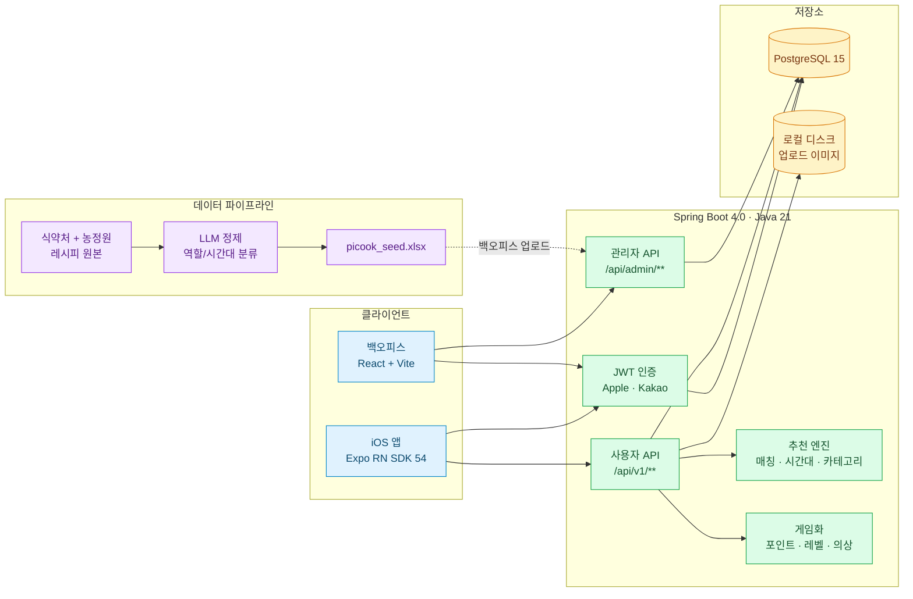
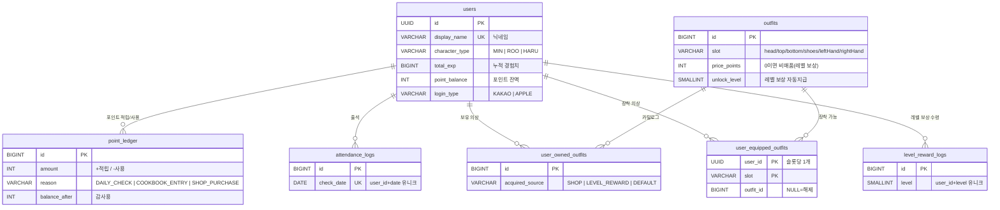
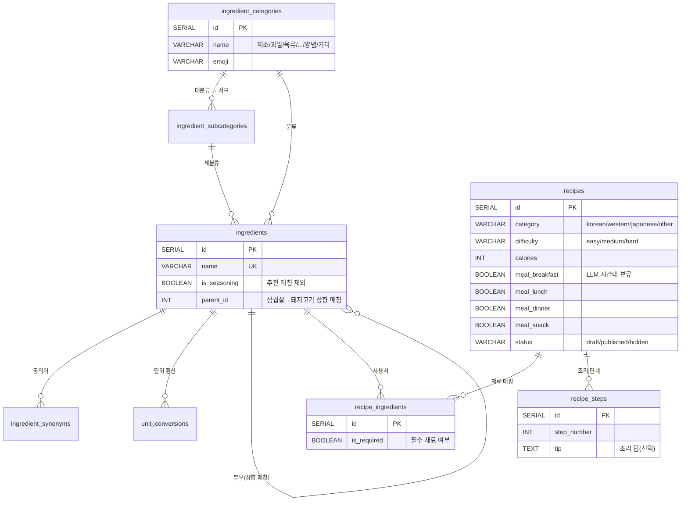
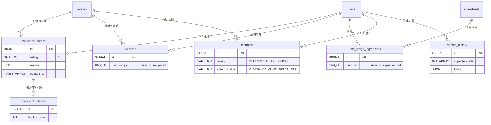

# Picook

> 냉장고 재료로 오늘 뭐 해 먹을지 골라주고, 요리한 기록을 모아 요리사 캐릭터를 키우는 iOS 앱

[]() []() []() []()

> **현재 테스트 단계입니다.** 정식 출시 전이며 스토어 배포는 준비 중입니다.

---

## Picook이 뭔가요

> "오늘 뭐 해 먹지" 라는 질문에서 시작했습니다.

냉장고에 뭐가 있는지 체크만 하면 그걸로 만들 수 있는 레시피를 매칭률 순으로 추천해줍니다. 시간이 늦었다면 야식, 아침이라면 가벼운 메뉴 — 그 시간대에 어울리는 메뉴를 LLM이 분류해 둔 4-슬롯 추천도 보여주고요.

요리를 마치면 별점·메모·사진을 남겨 **나만의 요리북**을 채워나갈 수 있습니다. 기록할수록 요리사 캐릭터가 레벨업하고, 새로운 의상·도구를 보상으로 얻어 캐릭터를 꾸미는 재미가 더해집니다. 요리에 대한 동기를 게임처럼 가볍게 유지하는 게 핵심입니다.

---

## 핵심 기능

### 메인 화면 — 4가지 방식의 추천

| 추천 | 설명 |
|------|------|
| **시간대별** | 아침/점심/저녁/야식 4슬롯. LLM(`gpt-5.4-mini`)이 1,498건 레시피를 시간대별로 분류한 결과 기반 |
| **카테고리** | 한식·양식·일식·기타 4종. 카드로 진입 → 인기순 페이지 |
| **저칼로리** | "가볍게 먹고 싶은 날" — 300kcal 이하 인기순 TOP 5 |
| **재료 매칭 추천** | 냉장고 재료 선택 → 매칭률 30% 이상 TOP 10 (양념 제외, 부족 재료 안내) |

### 요리북 (Cookbook)

요리 완료 인증 — 별점(1~5) + 메모(≤1,000자) + 사진 최대 4장으로 본인 기록을 남깁니다.
- 카드 / 그리드 두 가지 뷰
- 연·월별 필터, 4가지 정렬(최신/오래된/별점 높은/낮은 순)
- 사진 업로드 시 포인트 +50, 경험치 +80 보상

### 캐릭터 + 게임화

| 요소 | 내용 |
|------|------|
| **캐릭터 3종** | MIN / ROO / HARU — 가입 시 선택 |
| **레벨 7단계** | 병아리(Lv.1) → 탐험가 → 파이터 → 장인 → 마스터 → 셰프 → 전설(Lv.7), `total_exp` 누적 기준 |
| **의상 6슬롯** | head / top / bottom / shoes / leftHand / rightHand |
| **포인트** | 출석 +10, 요리북 인증 +50 — 의상 상점 구매 가능 |
| **레벨 보상** | 특정 레벨 도달 시 한정 의상 자동 지급 (예: Lv.5 프라이팬, Lv.7 셰프 의상) |
| **출석체크** | 일일 1회 자동 — 7일 스트릭 표시 |

### 그 외

- **냉장고**: 보유 재료를 체크해두면 추천 화면에서 즉시 재료 프리필
- **즐겨찾기**: 레시피 북마크
- **검색 이력**: 최근 추천 조합 재사용

---

## 시스템 구성



---

## 데이터 모델 (도메인별)

전체 22개 테이블을 의미별로 묶은 관계도입니다. 상세 컬럼은 [backend/README.md](backend/README.md#db-스키마) 참고.

### 1) 사용자 + 게임화 (캐릭터·포인트·레벨·의상·출석)



### 2) 재료 + 레시피



### 3) 사용자 활동 (요리북 · 즐겨찾기 · 냉장고 · 피드백 · 검색)



---

## 모노레포 구조

```
picook/
├── backend/        Spring Boot 4.0 · Java 21 · PostgreSQL 15
├── mobile/         Expo SDK 54 · React Native · TypeScript
├── admin/          React 19 · Vite 7 · Ant Design 5 (백오피스 웹)
├── infra/          docker-compose.yml · Nginx · Vector(로그 수집)
└── docs/           기획·설계 문서 · UI 프로토타입
```

---

## 실행 방법

전체 스택을 한 번에 띄우는 가장 빠른 방법:

```bash
# 1. DB + 백엔드 실행 (도커)
cd infra
docker compose up -d
# postgres → localhost:5432
# backend  → localhost:8080

# 2. 백오피스 (별도 터미널)
cd admin
npm install && npm run dev
# → http://localhost:5173
# 로그인: admin@picook.com / !@#admina

# 3. 시드 데이터 업로드
# 백오피스 로그인 → 시드 관리 → picook_seed.xlsx 업로드
# (재료/레시피 데이터가 들어옴)

# 4. 모바일 (별도 터미널)
cd mobile
npm install && npx expo start
# Expo Go로 QR 스캔 — 카카오 로그인은 네이티브 빌드 필요
```

각 컴포넌트의 **상세 실행/설정 가이드**는 해당 디렉토리 README를 참고하세요.

| 컴포넌트 | README |
|----------|--------|
| 백엔드 | [backend/README.md](backend/README.md) |
| 모바일 | [mobile/README.md](mobile/README.md) |
| 백오피스 | [admin/README.md](admin/README.md) |

---

## 데이터 파이프라인

레시피·재료 시드는 **LLM 정제 결과를 단일 엑셀 파일로 패키징**한 뒤 백오피스에서 업로드하는 구조입니다.

```
[식약처 + 농정원 원본]
        │
        ▼
[Python 정제 스크립트 + gpt-5.4-mini]
  · step8_classify_roles      재료 필수/선택 재분류 (1,008건)
  · step9_classify_meal_time  시간대 4슬롯 분류 (1,498건)
        │
        ▼
[picook_seed.xlsx]
  시트: categories / subcategories / ingredients /
        unit_conversions / recipes / recipe_ingredients / recipe_steps
        │
        ▼
[백오피스 → 시드 관리 → 업로드]
        │
        ▼
[SeedImportService]
  단일 트랜잭션으로 INSERT, 어느 시트 실패 시 전체 롤백
```

**왜 마이그레이션이 아니라 엑셀인가?**
스키마 변경 없이도 데이터를 갈아끼울 수 있고, 비개발자(기획·운영)도 검수할 수 있는 형태로 두기 위함입니다. Flyway는 DDL만 담당하고, 시드 데이터는 운영 도구로 분리.

---

## 기술 스택

| 영역 | 스택 |
|------|------|
| **백엔드** | Spring Boot 4.0.3 · Java 21 · Spring Security + JWT · Spring Data JPA · Apache POI |
| **DB** | PostgreSQL 15 (Docker) · Flyway 마이그레이션 |
| **모바일** | React Native · Expo SDK 54 · TypeScript · expo-router · Zustand · TanStack React Query |
| **백오피스** | React 19 · Vite 7 · Ant Design 5 · React Hook Form + Zod · SheetJS |
| **인증** | Apple Sign-In · Kakao OAuth · JWT (액세스 1h / 리프레시 30d) |
| **인프라** | Docker Compose · Nginx · GitHub Actions · Vector(로그) |
| **데이터** | Python 정제 스크립트 · OpenAI API (`gpt-5.4-mini`) |

---

## 라이선스 / 상태

비공개 프로젝트 — 정식 출시 전 테스트 단계입니다.
