# Picook Backend

> Spring Boot 4.0.3 + Java 21 + PostgreSQL 15 — Picook의 모놀리식 API 서버

사용자 앱과 백오피스의 모든 API를 단일 서버에서 처리합니다. 핵심은 **재료·시간대·카테고리·저칼로리 4가지 추천 엔진**, **요리북 인증 + 보상**, **포인트·레벨·의상 게임화 시스템**입니다.

---

## 기술 스택

| 분류 | 기술 |
|------|------|
| 프레임워크 | Spring Boot 4.0.3 (Java 21 LTS) |
| 빌드 | Gradle (Kotlin DSL) |
| DB | PostgreSQL 15 (Docker) |
| ORM | Spring Data JPA + Hibernate |
| 마이그레이션 | Flyway |
| 인증 | Spring Security + JWT (액세스 1h / 리프레시 30d) |
| API 문서 | SpringDoc OpenAPI 3.0 (Swagger UI) |
| 캐싱 | Spring Cache (`ConcurrentMapCacheManager`) |
| 엑셀 | Apache POI (시드 일괄 업로드) |
| 외부 통신 | WebFlux WebClient (Apple/카카오 토큰 검증) |
| 파일 저장 | 로컬 디스크 (`/data/picook/uploads/`) |
| 로깅 | Logback + 구조화 JSON |
| 메트릭 | Micrometer + Prometheus |
| 테스트 | JUnit 5 + Mockito |

---

## 도메인 구조

```
com.picook/
├── config/                       Security · JWT · Cors · Cache · RateLimit · Logging · Metric
│
├── domain/
│   ├── auth/                     Apple · 카카오 · JWT 발급
│   ├── user/                     사용자 프로필 · 등급(UserLevelService)
│   ├── ingredient/               재료 · 카테고리 · 서브카테고리 · 동의어 · 단위환산
│   ├── recipe/                   레시피 · 단계 · 추천 엔진(매칭/시간대/카테고리/저칼로리)
│   ├── cookbook/                 요리 완료 인증 (별점/메모/사진 4장)
│   ├── fridge/                   사용자 냉장고 (보유 재료)
│   ├── favorite/                 즐겨찾기
│   ├── searchhistory/            검색 이력
│   ├── feedback/                 피드백
│   ├── point/                    포인트 적립/사용 (PointLedger)
│   ├── attendance/               출석체크
│   ├── outfit/                   의상 카탈로그/구매/장착/레벨 보상
│   ├── monitoring/               운영 모니터링 (DAU/MAU)
│   ├── file/                     파일 업로드 (LocalFileService)
│   └── admin/                    백오피스 API 12개 서브도메인
│       ├── auth · dashboard · recipe · ingredient · category
│       ├── subcategory · outfit · seed · user · feedback
│       └── stats · account
│
└── global/                       ApiResponse · PageResponse · Exception · AOP
```

---

## API 엔드포인트

### Auth — 공개

| Method | Endpoint | 설명 |
|--------|----------|------|
| POST | `/api/auth/kakao` | 카카오 로그인 |
| POST | `/api/auth/apple` | Apple 로그인 |
| POST | `/api/auth/refresh` | JWT 토큰 갱신 |
| POST | `/api/auth/logout` | 로그아웃 (stateless — 서버 200 응답) |

### User — 인증 필요

#### 사용자 / 재료
| Method | Endpoint | 설명 |
|--------|----------|------|
| GET / PUT / DELETE | `/api/v1/users/me` | 내 프로필 조회 / 수정 / 탈퇴(30일 유예) |
| GET | `/api/v1/ingredients` | 전체 재료 (캐시) |
| GET | `/api/v1/ingredients/categories` | 카테고리 목록 |

#### 레시피 — 4가지 추천
| Method | Endpoint | 설명 |
|--------|----------|------|
| POST | `/api/v1/recipes/recommend` | **재료 매칭 추천** — 매칭률 30%+ TOP 10 |
| GET | `/api/v1/recipes/recommend-by-time?period=` | **시간대 추천** — breakfast/lunch/dinner/midnight TOP 5 |
| GET | `/api/v1/recipes/category-counts` | **카테고리 카드** — published 건수 (캐시) |
| GET | `/api/v1/recipes?category=&page=&size=` | 카테고리별 페이지 |
| GET | `/api/v1/recipes/recommend-low-calorie?limit=` | **저칼로리 추천** — ≤300kcal TOP 5 |
| GET | `/api/v1/recipes/{id}` | 레시피 상세 (재료 + 단계 + 팁) |

#### 활동
| Method | Endpoint | 설명 |
|--------|----------|------|
| GET / POST / DELETE | `/api/v1/favorites` | 즐겨찾기 |
| POST `entries` / GET / GET `{id}` | `/api/v1/cookbook` | 요리북 인증 (multipart: rating · memo · photos[≤4]) |
| GET | `/api/v1/cookbook/stats?yearMonth=` | 월별 요리 횟수 |
| GET / POST / DELETE / PUT | `/api/v1/fridge/ingredients` | 냉장고 재료 관리 |
| GET / DELETE | `/api/v1/search-history` | 검색 이력 |

#### 게임화
| Method | Endpoint | 설명 |
|--------|----------|------|
| GET | `/api/v1/points/balance` | 포인트 잔액 |
| GET | `/api/v1/points/history` | 포인트 적립/사용 이력 |
| GET | `/api/v1/attendance/today` | 오늘 출석 상태 + 7일 스트릭 |
| POST | `/api/v1/attendance/check-in` | 출석체크 (포인트 +10) |
| GET | `/api/v1/outfits` | 전체 의상 카탈로그 |
| GET | `/api/v1/outfits/me` | 내가 보유한 의상 |
| POST | `/api/v1/outfits/me/purchase` | 의상 구매 (포인트 차감) |
| PUT | `/api/v1/outfits/me/equip` | 슬롯별 장착 변경 |

#### 파일
| Method | Endpoint | 설명 |
|--------|----------|------|
| POST | `/api/v1/files/upload` | 이미지 업로드 (카테고리 화이트리스트) |

### Admin — 역할 기반

| 그룹 | 엔드포인트 | 권한 |
|------|------------|------|
| 인증 | `/api/admin/auth/{login,refresh,logout,me,password}` | 공개/인증 |
| 대시보드 | `/api/admin/dashboard/{summary,charts,rankings}` | CONTENT+ |
| 레시피 | `/api/admin/recipes/...` (CRUD + 상태변경 + 엑셀 일괄) | CONTENT+ |
| 재료 | `/api/admin/ingredients/...` (CRUD + 엑셀) | CONTENT+ |
| 카테고리 | `/api/admin/categories/...` (CRUD + reorder) | CONTENT+ |
| 서브카테고리 | `/api/admin/subcategories/...` | CONTENT+ |
| 의상 | `/api/admin/outfits/...` (CRUD) | CONTENT+ |
| **시드 일괄 업로드** | `/api/admin/seed/upload` (picook_seed.xlsx) | CONTENT+ |
| 유저 | `/api/admin/users/...` (목록/정지/하위 리소스) | **SUPER** |
| 피드백 | `/api/admin/feedback/...` (상태/메모) | CONTENT+ |
| 통계 | `/api/admin/stats/{users,recipes,ingredients,ranking}` | VIEWER+ |
| 계정 | `/api/admin/accounts/...` (관리자 CRUD) | **SUPER** |

---

## DB 스키마

마이그레이션은 V1~V28의 누적 결과를 **V1/V2 단일 베이스라인으로 통합**한 상태입니다 (테스트 단계라 가능).

```
src/main/resources/db/migration/
├── V1__schema.sql               전체 DDL (테이블 22 + 인덱스 + CHECK + FK)
└── V2__seed_admin_outfits.sql   admin 1건 + 기본 의상 7건
```

대카테고리/서브카테고리/재료/레시피 시드는 **백오피스 엑셀 업로드**로 들어옵니다.

### 테이블 22개 — 의미별 그룹

```mermaid
erDiagram
    users ||--o{ point_ledger : ""
    users ||--o{ attendance_logs : ""
    users ||--o{ user_owned_outfits : ""
    users ||--o{ user_equipped_outfits : ""
    users ||--o{ level_reward_logs : ""
    users ||--o{ cookbook_entries : ""
    users ||--o{ favorites : ""
    users ||--o{ user_fridge_ingredients : ""
    users ||--o{ feedback : ""
    users ||--o{ search_history : ""
    outfits ||--o{ user_owned_outfits : ""
    outfits ||--o{ user_equipped_outfits : ""

    cookbook_entries ||--o{ cookbook_photos : ""
    recipes ||--o{ cookbook_entries : ""
    recipes ||--o{ favorites : ""
    recipes ||--o{ feedback : ""
    recipes ||--o{ recipe_ingredients : ""
    recipes ||--o{ recipe_steps : ""

    ingredient_categories ||--o{ ingredient_subcategories : ""
    ingredient_categories ||--o{ ingredients : ""
    ingredient_subcategories ||--o{ ingredients : ""
    ingredients ||--o{ ingredient_synonyms : ""
    ingredients ||--o{ unit_conversions : ""
    ingredients ||--o{ recipe_ingredients : ""
    ingredients ||--o{ ingredients : "parent_id"
    ingredients ||--o{ user_fridge_ingredients : ""

    users {
        UUID id PK
        VARCHAR display_name UK
        VARCHAR oauth_name
        VARCHAR login_type "KAKAO|APPLE"
        VARCHAR character_type "MIN|ROO|HARU"
        BIGINT total_exp
        INT point_balance
        INT completed_cooking_count
        VARCHAR status "ACTIVE|SUSPENDED|DELETED"
    }
    admin_users {
        SERIAL id PK
        VARCHAR email UK
        VARCHAR role "SUPER_ADMIN|CONTENT_ADMIN|VIEWER"
        BOOLEAN is_locked "5회 실패 → 15분 잠금"
    }
    ingredient_categories { SERIAL id PK }
    ingredient_subcategories { SERIAL id PK }
    ingredients {
        SERIAL id PK
        VARCHAR name UK
        BOOLEAN is_seasoning
        INT parent_id "상향 매칭"
    }
    ingredient_synonyms { SERIAL id PK }
    unit_conversions { SERIAL id PK }
    recipes {
        SERIAL id PK
        VARCHAR category "korean|western|japanese|other"
        VARCHAR difficulty "easy|medium|hard"
        BOOLEAN meal_breakfast
        BOOLEAN meal_lunch
        BOOLEAN meal_dinner
        BOOLEAN meal_snack
        VARCHAR status "draft|published|hidden"
    }
    recipe_ingredients {
        SERIAL id PK
        BOOLEAN is_required
    }
    recipe_steps {
        SERIAL id PK
        TEXT tip "조리 팁"
    }
    favorites { SERIAL id PK }
    feedback { SERIAL id PK }
    search_history { SERIAL id PK }
    user_fridge_ingredients { BIGINT id PK }
    cookbook_entries {
        BIGINT id PK
        SMALLINT rating "1~5"
    }
    cookbook_photos { BIGINT id PK }
    point_ledger {
        BIGINT id PK
        VARCHAR reason "DAILY_CHECK|COOKBOOK_ENTRY|SHOP_PURCHASE"
    }
    attendance_logs { BIGINT id PK }
    outfits {
        BIGINT id PK
        VARCHAR slot "head|top|bottom|shoes|leftHand|rightHand"
        SMALLINT unlock_level
    }
    user_owned_outfits {
        BIGINT id PK
        VARCHAR acquired_source "SHOP|LEVEL_REWARD|DEFAULT"
    }
    user_equipped_outfits {
        UUID user_id PK
        VARCHAR slot PK
    }
    level_reward_logs { BIGINT id PK }
```



---

## 추천 엔진

### 1. 재료 매칭 추천 — `RecommendService`

```
입력: ingredientIds[], maxTime?, difficulty?, servings?
1. recipe_ingredients 와 사용자 재료 교집합 계산 (양념 제외 — is_seasoning=false 만)
2. 매칭률 = 보유 메인재료 / 전체 메인재료
3. 매칭률 30% 미만 제외 (RecommendService.MIN_MATCH_RATE)
4. 시간/난이도/인분 필터
5. 매칭률 DESC → TOP 10
6. 부족 메인재료 + 부족 양념 별도 응답
```

**상향 매칭** — 사용자가 자식(예: 삼겹살)을 보유하면 부모(돼지고기)도 매칭 인정. `ingredients.parent_id` 1단계 위로 올라가며 비교 (sibling 매칭은 X).

### 2. 시간대 추천 — `RecipeService.recommendByTime`

LLM(`gpt-5.4-mini`)이 1,498건 레시피를 4슬롯에 사전 분류 → `recipes.meal_*` 4컬럼.

| API period | DB 컬럼 | 시간 범위 (모바일) |
|------------|---------|---------------------|
| `breakfast` | `meal_breakfast` | 06–10 |
| `lunch` | `meal_lunch` | 10–15 |
| `dinner` | `meal_dinner` | 15–21 |
| `midnight` | `meal_snack` | 21–06 |

published + view_count DESC TOP 5. 슬롯별 부분 인덱스로 쿼리 가벼움.

### 3. 카테고리 카운트 / 페이지

`@Cacheable("recipe-category-counts")` — 레시피 CRUD / 시드 업로드 시 evict.

### 4. 저칼로리 추천

`calories ≤ 300` + view_count DESC, 기본 5건 (최대 20).

---

## 요리북 인증 — `CookbookService`

```
입력: recipeId, rating(1~5), memo(≤1,000자), photos[] (최대 4장)
1. 사진 4장 초과 → PHOTO_LIMIT_EXCEEDED (400)
2. 레시피 존재 + 미삭제 검증
3. CookbookEntry 저장 + 사진 LocalFileService.upload(..., "cookbook")
4. User.completed_cooking_count +1
5. 사진 1장 이상이면:
   · 포인트 +50 (PointReason.COOKBOOK_ENTRY)
   · 경험치 +80 → UserLevelService.awardExp → 레벨업 시 의상 자동 지급
6. 응답: sequenceNumber, leveledUp, newLevel, grantedOutfits
```

레벨 산정 — `total_exp` 누적값을 7단계 컷오프로 매핑 (`UserLevelService`).

---

## 인증/인가

### 사용자 (JWT)

```
[Apple/카카오 로그인]
   ↓ identityToken | kakaoAccessToken
[서버: Apple 공개키 | 카카오 /v2/user/me 검증]
   ↓
[User 조회/생성 → JWT 발급]
   ↓ access 1h + refresh 30d
[클라이언트 Bearer]
   ↓ 401 → /api/auth/refresh
```

### 관리자

- 이메일/bcrypt(cost 12) 로그인
- 3등급: `SUPER_ADMIN` > `CONTENT_ADMIN` > `VIEWER`
- 5회 실패 → 15분 잠금
- 액세스 1h, 리프레시 8h

```java
.requestMatchers("/api/admin/auth/login").permitAll()
.requestMatchers("/api/admin/accounts/**").hasRole("SUPER_ADMIN")
.requestMatchers("/api/admin/users/**").hasRole("SUPER_ADMIN")
.requestMatchers(GET, "/api/admin/stats/**").hasAnyRole("SUPER_ADMIN","CONTENT_ADMIN","VIEWER")
.requestMatchers("/api/admin/**").hasAnyRole("SUPER_ADMIN","CONTENT_ADMIN")
.requestMatchers("/api/v1/**").authenticated()
```

---

## 시드 데이터 업로드 — `SeedImportService`

`picook_seed.xlsx` 한 파일에 7시트:

| 시트 | 컬럼 |
|------|------|
| `categories` | id, name, sort_order, emoji |
| `subcategories` | category, name, sort_order |
| `ingredients` | name, category, subcategory, parent_name, is_seasoning, default_unit, aliases |
| `unit_conversions` | ingredient_name, from_unit, to_unit, conversion |
| `recipes` | temp_id, title, category, difficulty, cooking_time, servings, calories, thumbnail, tips, status, meal_breakfast, meal_lunch, meal_dinner, meal_snack |
| `recipe_ingredients` | recipe_temp_id, ingredient_name, amount, unit, is_required, sort_order |
| `recipe_steps` | recipe_temp_id, step_number, description, image_url, tip |

처리 순서: categories → subcategories → ingredients (+ synonyms + parent 2-pass) → unit_conversions → recipes → recipe_ingredients → recipe_steps. **단일 트랜잭션** — 어느 시트든 치명 에러 시 전체 롤백.

재료 이름 해석은 7단계 폴백 — 정확 매칭 → 괄호 제거 → 공백 제거 → 처리상태 prefix(잘게 다진/불린/...) 제거 → 첫 단어 → 마지막 단어. `물/얼음/쌀뜨물` 등은 의도적 SKIP.

---

## 실행

### 도커 (DB + 백엔드 동시)

```bash
cd ../infra
docker compose up -d
# postgres → localhost:5432
# backend  → localhost:8080
```

### IDE / Gradle (DB만 도커, 백엔드는 로컬)

```bash
cd ../infra
docker compose up -d postgres
cd ../backend
./gradlew bootRun
# Swagger UI → http://localhost:8080/swagger-ui.html
```

### 테스트

```bash
./gradlew test
```

### 환경 프로필

| 프로필 | 용도 | 특징 |
|--------|------|------|
| `local` | 로컬 개발 | 디버그 로깅, Swagger 활성화 |
| `prod` | 운영 | 구조화 JSON 로깅, 메트릭 활성화 |

### 환경변수

`backend/secrets.env` 한 파일로 통합 (gitignore). 도커는 `infra/docker-compose.yml`의 `env_file:`로 주입, 로컬 IDE는 `application.yml`의 `spring.config.import`로 자동 로드.

| 변수 | 설명 |
|------|------|
| `SPRING_PROFILES_ACTIVE` | `local` / `prod` |
| `JWT_SECRET` | 32바이트 이상 |
| `DB_HOST` / `DB_PORT` / `DB_NAME` / `DB_USERNAME` / `DB_PASSWORD` | PostgreSQL 접속 |
| `FILE_UPLOAD_DIR` | 업로드 디렉토리 (기본 `/data/picook/uploads`) |
| `APPLE_BUNDLE_ID` | Apple Sign-In 검증용 |
| `MONITORING_ALLOWED_IPS` | 모니터링 엔드포인트 허용 IP (콤마) |
| `TRUSTED_PROXIES` | 신뢰 프록시 IP (콤마) |

---

## 로깅 / 메트릭

### 로그 파일 (`prod` 프로필)

| 파일 | 레벨 | 보관 |
|------|------|------|
| `/var/log/picook/app.log` | INFO+ | 30일, 1GB |
| `/var/log/picook/error.log` | ERROR | 90일, 500MB |
| `/var/log/picook/perf.log` | INFO | 30일 (서비스 메서드 1초+ WARN) |
| `/var/log/picook/sql.log` | OFF (필요 시 활성화) | 7일 |

`RequestLoggingFilter` + MDC로 요청별 컨텍스트, AOP `PerformanceLoggingAspect`로 서비스 메서드 성능 측정. Vector 컨테이너가 로그를 수집해 외부로 전송.

### 메트릭

`PicookMetricsConfig`에서 비즈니스 메트릭 (추천 호출, 시드 업로드, 인증 실패 등) Prometheus 노출.

---

## 캐시 무효화 매트릭스

| 캐시 키 | Cacheable | CacheEvict |
|---------|-----------|------------|
| `ingredients` | `IngredientService.getAllIngredients` | AdminIngredientService(create/update/delete), IngredientBulkUploadService, SeedImportService |
| `categories` | `IngredientService.getCategories` | AdminCategoryService(create/update/delete/reorder), SeedImportService |
| `recipe-category-counts` | `RecipeService.getCategoryCounts` | AdminRecipeService(create/update/delete/changeStatus), SeedImportService |
