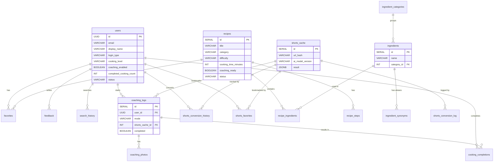

# Picook Database

> PostgreSQL 15 + Flyway 마이그레이션 + AI 데이터 정제 파이프라인

## 소개

Picook의 데이터베이스 스키마, 마이그레이션, 시드 데이터, 데이터 정제 스크립트를 관리합니다. 19개 테이블, 13개 Flyway 마이그레이션, 2개 트리거로 구성되며, 식품안전나라 공공 API 데이터를 Claude AI로 정제하여 서비스에 투입하는 파이프라인을 포함합니다.

---

## 실행 방법

```bash
cd backend
docker compose up -d
# PostgreSQL 15 → localhost:5432
# DB: picook_db, User: picook_user, Password: picook_local_pw
```

Spring Boot 구동 시 Flyway가 마이그레이션 자동 실행:
```bash
./gradlew bootRun --args='--spring.profiles.active=local'
# V1~V13 순차 적용
```

---

## ERD



---

## 테이블 스키마 상세 (19개)

### users
사용자 계정 정보 + 요리 설정 + 등급

| 컬럼 | 타입 | 제약조건 | 설명 |
|------|------|----------|------|
| id | UUID | PK, DEFAULT gen_random_uuid() | |
| email | VARCHAR(255) | | |
| display_name | VARCHAR(50) | | |
| profile_image_url | TEXT | | |
| login_type | VARCHAR(20) | CHECK (KAKAO, APPLE) | 소셜 로그인 타입 |
| kakao_id | VARCHAR(100) | | |
| apple_id | VARCHAR(100) | | |
| cooking_level | VARCHAR(20) | DEFAULT BEGINNER, CHECK (4종) | BEGINNER/EASY/INTERMEDIATE/ADVANCED |
| coaching_enabled | BOOLEAN | DEFAULT TRUE | 음성 코칭 활성화 |
| coaching_voice_speed | DECIMAL(2,1) | DEFAULT 1.0 | TTS 속도 |
| completed_cooking_count | INT | DEFAULT 0 | 등급 산출용 (트리거 자동 증가) |
| is_onboarded | BOOLEAN | DEFAULT FALSE | 온보딩 완료 여부 |
| status | VARCHAR(20) | DEFAULT ACTIVE, CHECK (3종) | ACTIVE/SUSPENDED/DELETED |
| created_at | TIMESTAMPTZ | DEFAULT NOW() | |

### ingredient_categories
재료 카테고리 (8종)

| 컬럼 | 타입 | 설명 |
|------|------|------|
| id | SERIAL | PK |
| name | VARCHAR(50) | 채소, 과일, 육류, 해산물, 유제품/계란, 곡류/면, 양념/소스, 기타 |
| sort_order | INT | 표시 순서 |

### ingredients
재료 마스터 데이터

| 컬럼 | 타입 | 제약조건 | 설명 |
|------|------|----------|------|
| id | SERIAL | PK | |
| name | VARCHAR(100) | NOT NULL, UNIQUE | 정규화된 재료명 |
| category_id | INT | FK → ingredient_categories | |
| icon_url | TEXT | | |

### ingredient_synonyms
재료 동의어 (초성 검색/매칭용)

| 컬럼 | 타입 | 설명 |
|------|------|------|
| id | SERIAL | PK |
| ingredient_id | INT | FK → ingredients (CASCADE) |
| synonym | VARCHAR(100) | 예: 계란 → 달걀 |

### recipes
레시피 메타데이터

| 컬럼 | 타입 | 제약조건 | 설명 |
|------|------|----------|------|
| id | SERIAL | PK | |
| title | VARCHAR(200) | NOT NULL | |
| category | VARCHAR(50) | CHECK (8종) | korean/western/chinese/japanese/snack/dessert/drink/other |
| difficulty | VARCHAR(20) | CHECK (3종) | easy/medium/hard |
| cooking_time_minutes | INT | NOT NULL | |
| servings | INT | DEFAULT 2 | |
| total_ingredients | INT | DEFAULT 0 | 필수 재료 수 (매칭률 계산용) |
| coaching_ready | BOOLEAN | DEFAULT FALSE | **트리거 자동 계산** |
| status | VARCHAR(20) | DEFAULT draft | draft/published/hidden |

### recipe_ingredients
레시피-재료 매핑

| 컬럼 | 타입 | 설명 |
|------|------|------|
| id | SERIAL | PK |
| recipe_id | INT | FK → recipes (CASCADE) |
| ingredient_id | INT | FK → ingredients |
| amount | DECIMAL(10,2) | 수량 |
| unit | VARCHAR(20) | 단위 (g, ml, 개 등) |
| is_required | BOOLEAN | 필수 재료 여부 (매칭률에 반영) |
| sort_order | INT | 표시 순서 |

### recipe_steps
조리 단계 (코칭 엔진의 핵심 데이터)

| 컬럼 | 타입 | 설명 |
|------|------|------|
| id | SERIAL | PK |
| recipe_id | INT | FK → recipes (CASCADE) |
| step_number | INT | 단계 번호 |
| description | TEXT | 조리 설명 |
| step_type | VARCHAR(10) | **active** (손 필요) / **wait** (대기) |
| duration_seconds | INT | 소요 시간 (초) |
| can_parallel | BOOLEAN | 멀티 코칭 시 병렬 가능 여부 |

### favorites
레시피 즐겨찾기

| 컬럼 | 타입 | 제약조건 |
|------|------|----------|
| id | SERIAL | PK |
| user_id | UUID | FK → users (CASCADE) |
| recipe_id | INT | FK → recipes (CASCADE) |
| created_at | TIMESTAMPTZ | |
| | | UNIQUE (user_id, recipe_id) |

### coaching_logs
코칭 세션 로그

| 컬럼 | 타입 | 설명 |
|------|------|------|
| id | SERIAL | PK |
| user_id | UUID | FK → users |
| mode | VARCHAR(10) | single / multi |
| recipe_ids | INT[] | 레시피 ID 배열 |
| shorts_cache_id | INT | FK → shorts_cache (쇼츠 기반 코칭) |
| estimated_seconds | INT | 예상 소요시간 |
| actual_seconds | INT | 실제 소요시간 |
| completed | BOOLEAN | 완료 여부 |

### cooking_completions
조리 완료 기록 (등급 산출)

| 컬럼 | 타입 | 설명 |
|------|------|------|
| id | SERIAL | PK |
| user_id | UUID | FK → users |
| recipe_id | INT | nullable (쇼츠 코칭은 null) |
| coaching_log_id | INT | FK → coaching_logs |
| photo_url | TEXT | 완성 사진 URL |
| | | **INSERT 트리거**: users.completed_cooking_count += 1 |

### coaching_photos
코칭 완료 사진 (멀티 업로드)

| 컬럼 | 타입 | 설명 |
|------|------|------|
| id | SERIAL | PK |
| coaching_log_id | INT | FK → coaching_logs (CASCADE) |
| photo_url | VARCHAR(500) | |
| display_order | INT | 표시 순서 |

### shorts_cache
쇼츠 변환 캐시 (AI 결과 저장)

| 컬럼 | 타입 | 설명 |
|------|------|------|
| id | SERIAL | PK |
| youtube_url | VARCHAR(500) | 원본 URL |
| url_hash | VARCHAR(64) | SHA-256, UNIQUE |
| ai_model_version | VARCHAR(50) | 캐시 무효화 키 |
| result | JSONB | AI 구조화 결과 (steps, ingredients) |
| channel_name | VARCHAR(200) | YouTube 채널명 |
| original_title | VARCHAR(500) | 원본 영상 제목 |
| duration_seconds | INT | 영상 길이 |

### shorts_conversion_history
사용자별 변환 이력

| 컬럼 | 타입 | 설명 |
|------|------|------|
| id | SERIAL | PK |
| user_id | UUID | FK → users |
| shorts_cache_id | INT | FK → shorts_cache (CASCADE) |
| created_at | TIMESTAMPTZ | |

### shorts_conversion_log
변환 성능 추적 로그

| 컬럼 | 타입 | 설명 |
|------|------|------|
| id | SERIAL | PK |
| youtube_url | VARCHAR(500) | |
| status | VARCHAR(20) | SUCCESS / FAILED |
| cache_hit | BOOLEAN | 캐시 히트 여부 |
| total_ms | BIGINT | 전체 소요시간 |
| extract_ms | BIGINT | yt-dlp 음성 추출 |
| transcribe_ms | BIGINT | Whisper STT |
| structurize_ms | BIGINT | GPT 구조화 |

### shorts_favorites
쇼츠 즐겨찾기

| 컬럼 | 타입 | 제약조건 |
|------|------|----------|
| id | SERIAL | PK |
| user_id | UUID | FK → users (CASCADE) |
| shorts_cache_id | INT | FK → shorts_cache (CASCADE) |
| | | UNIQUE (user_id, shorts_cache_id) |

### feedback, search_history, admin_users, daily_stats
- **feedback**: 사용자 피드백 (rating: delicious/okay/difficult, 관리자 메모)
- **search_history**: 재료 검색 이력 (ingredient_ids 배열, filters JSONB)
- **admin_users**: 관리자 계정 (3등급 역할, 로그인 잠금)
- **daily_stats**: 일별 집계 (신규 유저, 활성 유저, 코칭, 쇼츠)

---

## 트리거

### coaching_ready 자동 갱신
`recipe_steps` INSERT/UPDATE/DELETE 시 → 해당 레시피의 `coaching_ready` 재계산

```sql
-- 모든 단계에 duration_seconds > 0이면 TRUE
UPDATE recipes SET coaching_ready = (
    SELECT COUNT(*) > 0 AND COUNT(*) = COUNT(CASE WHEN duration_seconds > 0 THEN 1 END)
    FROM recipe_steps WHERE recipe_id = NEW.recipe_id
)
```

### completed_cooking_count 자동 증가
`cooking_completions` INSERT 시 → 해당 사용자의 `completed_cooking_count` + 1

```sql
UPDATE users SET completed_cooking_count = completed_cooking_count + 1
WHERE id = NEW.user_id
```

---

## 마이그레이션 히스토리

| 버전 | 파일명 | 내용 | 비고 |
|------|--------|------|------|
| V1 | `V1__init_schema.sql` | 17개 코어 테이블 + 인덱스 생성 | 초기 스키마 |
| V2 | `V2__seed_categories.sql` | 재료 카테고리 8종 | 채소, 과일, 육류, 해산물, 유제품/계란, 곡류/면, 양념/소스, 기타 |
| V3 | `V3__triggers.sql` | 2개 트리거 | coaching_ready + cooking_count |
| V4 | `V4__shorts_conversion_history.sql` | 쇼츠 변환 이력 테이블 | user ↔ shorts_cache 매핑 |
| V5 | `V5__feedback_updated_at.sql` | feedback.updated_at 추가 | |
| V6 | `V6__fix_enum_case_constraints.sql` | CHECK 제약 UPPERCASE 수정 | JPA @Enumerated 호환 |
| V7 | `V7__seed_test_data.sql` | 테스트 시드 데이터 | 관리자 1명, 재료 22개, 레시피 5개 |
| V8 | `V8__shorts_conversion_log.sql` | 변환 성능 로그 테이블 | 단계별 ms 추적 |
| V9 | `V9__shorts_cache_youtube_metadata.sql` | YouTube 메타데이터 컬럼 | 채널명, 원본 제목, 길이 |
| V10 | `V10__coaching_logs_shorts_cache_id.sql` | 쇼츠 기반 코칭 지원 | coaching_logs.shorts_cache_id FK |
| V11 | `V11__coaching_photos.sql` | 멀티 사진 업로드 | coaching_photos 테이블 + 데이터 마이그레이션 |
| V12 | `V12__shorts_favorites.sql` | 쇼츠 즐겨찾기 | shorts_favorites 테이블 |
| V13 | `V13__update_admin_password.sql` | 관리자 비밀번호 갱신 | bcrypt |

---

## 데이터 정제 파이프라인

식품안전나라 공공 API 데이터를 AI(Claude)로 정제하여 서비스 품질의 레시피 데이터를 생성합니다.

```
[1] API 수집                    [2] 재료 추출 + 분류
식품안전나라 API ───────→     원본에서 재료명 추출
1,000+ 레시피              ───→ Claude 카테고리 분류
                              ───→ 동의어 생성
                                    │
                                    ▼
[3] 레시피 정제                [4] 검수 + 투입
원본 JSON ─→ Claude API  ───→   엑셀 출력
 · 재료 파싱 (구분자 인식)       수작업 검수
 · 단계 분리 (active/wait)       백오피스 엑셀 일괄등록
 · duration_seconds 추정
 · 난이도 판단
```

### 스크립트 (`database/scripts/`)

| 스크립트 | 설명 |
|----------|------|
| `00_extract_ingredients.py` | 원본에서 재료명 추출 → Claude 카테고리 분류 → 동의어 생성 |
| `01_fetch_recipes.py` | 식품안전나라 API 전체 수집 → `raw_recipes.json` |
| `02_refine_with_claude.py` | Claude API로 레시피 정제 (step_type, duration, 재료 파싱) |
| `03_export_to_excel.py` | 정제 결과 → 검수용 엑셀 출력 |

### 시드 데이터 (`database/seeds/`)

| 파일 | 크기 | 설명 |
|------|------|------|
| `raw_recipes.json` | 2.5 MB | 식품안전나라 원본 (1,000+ 레시피) |
| `ingredients_classified.json` | 246 KB | Claude 분류 결과 |
| `ingredients_classified_reviewed.json` | 246 KB | 수작업 검수 완료 |
| `refined_recipes.json` | 17 KB | Claude 정제 결과 (step_type + duration) |

---

## 디렉토리 구조

```
database/
├── seeds/                          ← 원본/정제 데이터
│   ├── raw_recipes.json            ← 식품안전나라 API 원본
│   ├── ingredients_classified.json ← Claude 분류 결과
│   ├── refined_recipes.json        ← Claude 정제 결과
│   └── *.xlsx                      ← 검수용 엑셀
│
├── scripts/                        ← AI 정제 스크립트
│   ├── 00_extract_ingredients.py
│   ├── 01_fetch_recipes.py
│   ├── 02_refine_with_claude.py
│   ├── 03_export_to_excel.py
│   ├── fix_classification.py
│   ├── prompts/                    ← Claude 프롬프트
│   │   ├── ingredient_classify.txt
│   │   └── recipe_refine.txt
│   ├── requirements.txt
│   ├── .env.example
│   └── README.md                   ← 스크립트 사용법
│
└── (마이그레이션은 backend/src/main/resources/db/migration/ 에 위치)
```
